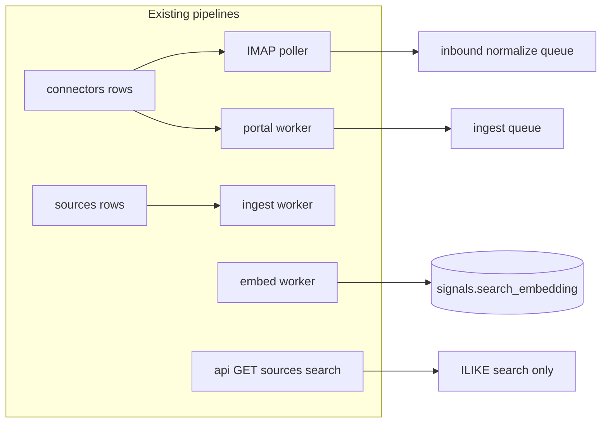

# Connect more data: implementation plan

## Current state (repo facts)

- **[`infra/db/001_landscrape_schema.sql`](infra/db/001_landscrape_schema.sql)** defines `connectors` with `connector_type IN ('crm','email','analytics','social','upload','other')`.
- **[`infra/db/002_worker_platform.sql`](infra/db/002_worker_platform.sql)** migrates `signals.search_embedding` to **`vector(768)`** (aligned with `nomic-embed-text` per comments).
- **Workers already consume `connectors`:**
  - Email: [`apps/worker/src/imapInbound.ts`](apps/worker/src/imapInbound.ts) — requires env `LANDSCRAPE_IMAP_*`, an active **`connector_type = 'email'`** row, and `connection_config.defaultInboundSourceId` pointing at a real `sources.source_id` UUID.
  - Portal: [`apps/worker/src/workers/portalWorker.ts`](apps/worker/src/workers/portalWorker.ts) — loads connector by id, merges `encrypted_payload` via [`@landscrape/crypto`](packages/crypto) when `LANDSCRAPE_CREDENTIALS_KEY` is set, then calls [`fetchPortalRenderedItems`](apps/worker/src/adapters.ts).
- **Scheduler** [`apps/worker/src/scheduler.ts`](apps/worker/src/scheduler.ts) already enqueues `portal:ingest` when `source_config.authMode === "portal"` and `connectorId` is present.
- **API** [`apps/api/src/server.ts`](apps/api/src/server.ts): `GET /v1/tenants/:tenantSlug/sources` (read-only); **no** connector or source mutating routes. Inbound **webhook** path exists (`POST /v1/inbound/webhook/:tenantSlug`).
- **Search** [`apps/api/src/repositories/searchRepository.ts`](apps/api/src/repositories/searchRepository.ts) uses **`ILIKE`** only; embeddings are written by [`apps/worker/src/workers/embedWorker.ts`](apps/worker/src/workers/embedWorker.ts) but unused in search.

---

## 1. Connectors: productize storage + HTTP surface

**Goal:** Stop requiring hand-written SQL for `connectors`; align with how workers read rows.

**Implement:**

- New repository module, e.g. [`apps/api/src/repositories/connectorRepository.ts`](apps/api/src/repositories/connectorRepository.ts): list/create/update/deactivate by `tenant_id`, validate `connector_type` against DB enum.
- **Secrets:** Reuse the portal pattern: accept plaintext fields in POST/PATCH body, serialize to `connection_config.encrypted_payload` (base64) via existing `encryptJson` when `LANDSCRAPE_CREDENTIALS_KEY` is set; document that without the key only non-secret JSON can be stored (or reject writes that require secrets).
- **Routes** (all gated by `LANDSCRAPE_INTERNAL_API_KEY` header, same pattern as [`server.ts`](apps/api/src/server.ts) webhook fallback using `config.internalApiKey`):
  - `GET /v1/tenants/:tenantSlug/connectors` — redact `encrypted_payload` or return masked metadata only.
  - `POST /v1/tenants/:tenantSlug/connectors` — body: `connector_name`, `connector_type`, `connection_config` (typed partial per connector_type via zod).
  - `PATCH /v1/tenants/:tenantSlug/connectors/:connectorId` — merge config, rotate secrets.
- **CRM / analytics / social / upload / other:** No worker sync exists today. **Do not** pretend full integrations. Ship **CRUD + validation** so configs can be stored and a future worker can read them; optionally add a **single** `sync:connector` queue job type that logs `job_runs` and no-ops or stores a raw JSON snapshot to a new table only if you want a visible “pipeline hook” (keep minimal to avoid scope creep).

---

## 2. IMAP inbound: turnkey configuration path

**Goal:** A documented, repeatable path from empty DB to working email → `inbound_events` → `inbound:normalize` → signals.

**Implement:**

- **Docs** (single short section in existing README or a small `docs/` file you already use): checklist — set `LANDSCRAPE_IMAP_HOST`, `PORT`, `USER`, `PASSWORD`, `TLS`; create **email** connector with `defaultInboundSourceId`; ensure target **source** row exists and matches ingest expectations (`source_type` drives `buildSignalDraft` in [`inboundWorker.ts`](apps/worker/src/workers/inboundWorker.ts)).
- **Optional SQL seed fragment** (idempotent, same style as [`001_landscrape_schema.sql`](infra/db/001_landscrape_schema.sql)): example `INSERT INTO connectors ... email` with **placeholder** `defaultInboundSourceId` commented — operator replaces UUID after creating a dedicated inbound source via API (step 5).
- **Wire convenience:** Add `POST /v1/tenants/:tenantSlug/connectors` validation so `email` type **requires** `defaultInboundSourceId` (UUID present in `sources` for that tenant).

No change to [`imapInbound.ts`](apps/worker/src/imapInbound.ts) logic unless you discover a bug; the gap is **operability + API**, not core polling.

---

## 3. Portal / authenticated sources

**Goal:** Create portal sources and connectors without SQL.

**Implement:**

- `POST /v1/tenants/:tenantSlug/sources` (internal key): body includes `source_name`, `source_type`, `base_url`, `poll_frequency_minutes`, `source_config` including **`authMode: "portal"`** and **`connectorId`** (must exist and belong to tenant). Validate against rules in [`scheduler.ts`](apps/worker/src/scheduler.ts) (portal branch).
- Ensure `connector.connection_config` contains `loginUrl`, `username`, `password` (encrypted), selectors — mirror fields read in [`portalWorker.ts`](apps/worker/src/workers/portalWorker.ts) lines 42–55.
- Document **Playwright** requirements (already in worker Dockerfile) and that `LANDSCRAPE_CREDENTIALS_KEY` should be set for non-dev.

---

## 4. Vector search (use `search_embedding`)

**Goal:** Search API uses embeddings already stored on `signals`.

**Implement:**

- In [`searchRepository.ts`](apps/api/src/repositories/searchRepository.ts) (or a sibling `semanticSearchRepository.ts`):
  - Import `embedText` from [`@landscrape/ai`](packages/ai/src/embeddings.ts) (API already depends on `@landscrape/ai`).
  - For a given query string, compute embedding, then query Postgres with pgvector distance, e.g. `ORDER BY search_embedding <=> $1::vector` with `WHERE tenant_id = $2 AND search_embedding IS NOT NULL`, `LIMIT n`.
  - **Hybrid:** Merge semantic hits with existing `ILIKE` results: dedupe by `signal_id`, optional weighted ordering (e.g. keyword first, then fill with semantic). Expose via query flag: `?mode=keyword|semantic|hybrid` on [`GET .../search`](apps/api/src/server.ts) (default `hybrid` or preserve current behavior as default for backward compatibility).
- **Performance:** Add an IVFFlat (or HNSW if pgvector version supports) index on `signals.search_embedding` in a new migration under [`infra/db/`](infra/db/) after validating row counts; start without index for dev if dataset is small.
- **Edge cases:** Null embeddings — fall back to keyword-only for those rows; short queries — keep existing `< 2` char early return.

---

## 5. Additional sources (non-SQL)

**Goal:** Same flexibility as seed [`INSERT INTO sources`](infra/db/001_landscrape_schema.sql) but via API.

**Implement:**

- `POST /v1/tenants/:tenantSlug/sources` — zod schema per `source_type` mirroring what [`fetchSourceItems`](apps/worker/src/adapters.ts) and `shouldUseRenderedMode` need (`rendered`, `query`+`retmax` for PubMed, `format`+`maxItems` for JSON congress feeds, etc.). Reject invalid combinations early.
- `PATCH /v1/tenants/:tenantSlug/sources/:sourceId` for `is_active`, `poll_frequency_minutes`, `source_config`, `base_url`.
- Optionally `GET /v1/tenants/:tenantSlug/sources/:sourceId` for admin/debug (fields from DB including `source_config` redacted).

**Security:** Internal API key only for mutating routes; read routes can stay public-as-today or require key — match your product stance for the web app (today [`apps/web/app/lib/api.ts`](apps/web/app/lib/api.ts) server-side uses `api:4000` without showing key; mutations would be server actions with secret or admin-only).

---

## Testing and acceptance

- **Unit/integration:** Repository tests for vector query shape (mock DB) and zod validation for connector/source payloads.
- **Manual:** Docker compose — create connector + source via API, trigger scheduler or wait for due poll, confirm `source_checks` / `source_items` / signals; run search with `mode=semantic` and compare to `keyword`.

---

## Out of scope (unless you explicitly expand)

- Vendor-specific CRM (Salesforce, Veeva), analytics (GA, Adobe), or social (LinkedIn/X) **sync implementations** — only the **connector row + future worker** pattern above.
- End-user admin UI in [`apps/admin`](apps/admin) — optional follow-up; API-first satisfies “productized” wiring.
