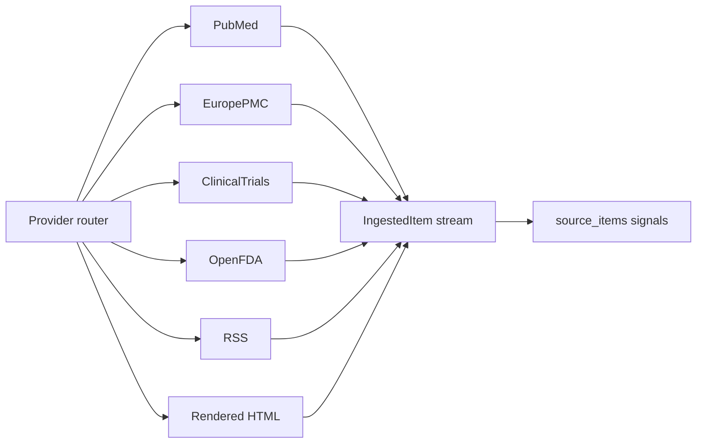

# Ingestion platform rebuild

## Guiding principle

**There are no fixed “codebase constraints.”** If a new source, volume, or UX goal conflicts with today’s implementation—**change the implementation**: refactor [`fetchSourceItems`](apps/worker/src/adapters.ts), replace or parameterize [`politeFetch`](apps/worker/src/politeFetch.ts), raise RSS limits, extend [`source_type`](infra/db/001_landscrape_schema.sql), add migrations, split monoliths into packages, or adjust [`buildSignalDraft`](apps/worker/src/adapters.ts). The plan below assumes **active refactors** wherever the current shape is inconvenient.

What exists in the repo today is only a **starting point** to preserve or replace incrementally—not a boundary.

---

## Target architecture (what we are building toward)

- **Provider modules**: One implementation per external family (PubMed, Europe PMC, ClinicalTrials.gov, openFDA, RSS feeds, rendered portals, etc.), each exporting `fetchItems(source: SourceRow): Promise<IngestedItem[]>`. A thin **router** in the worker chooses the provider from `source_type` and/or `source_config.provider`.
- **Configurable HTTP policy**: Per-host or per-provider intervals, concurrency, and timeouts—**not** a single global rule if product needs otherwise. NCBI `api_key` on all E-utility calls; documented aggregate rate budget across replicas.
- **Normalized output**: Keep the existing [`IngestedItem`](apps/worker/src/adapters.ts) contract so downstream [`ingestExecution`](apps/worker/src/ingestExecution.ts) and DB tables stay stable unless we **choose** to extend them (e.g. richer `metadata`, optional assets).
- **Schema and API in lockstep**: When we add providers, we update [`sourcePayloads`](apps/api/src/validation/sourcePayloads.ts) and docs so every source is validatable and operable from the API/admin.

---

## Workstream 1 — Router + PubMed + NCBI key

- Extract PubMed logic from the monolithic switch into `apps/worker/src/providers/pubmed.ts` (or `packages/ingest`).
- Add **`NCBI_API_KEY`** to [`packages/config`](packages/config/src/index.ts); append `api_key` on every PubMed E-utility URL the product uses.
- **Refactor fetch policy** as needed so NCBI throughput matches NLM rules without unnecessarily throttling unrelated hosts.

---

## Workstream 2 — High-value public APIs (new code first)

Implement dedicated providers with tests and fixtures (not “extend only if JSON matches”):

- **openFDA** (enforcement, drugs, devices as product prioritizes).
- **Europe PMC** (search → items).
- **ClinicalTrials.gov v2** with **config-driven** queries (`source_config` fields), not only hand-pasted URLs.

Each provider owns URL building, parsing, error messages, and `externalItemId` stability.

---

## Workstream 3 — RSS / press / “wide net” volume

- First-class **RSS provider**: configurable `maxItems`, robust `publishedAt`, dedupe by `guid`/`link`. **Remove or replace** any accidental low cap inherited from the generic branch—product decides the number.
- Optional: provider for **Atom-only** quirks, HTML summaries, or multi-feed aggregation per source.

---

## Workstream 4 — Schema, seeds, and taxonomy

- Extend **`source_type`** and/or **`source_config.provider`** when the domain model needs clarity (e.g. `news`, `press`, `grants`)—with migrations and API validation updates.
- **Idempotent seed SQL** (or migrations) per tenant/workspace: default bundles of sources using the new providers.
- Evolve [`buildSignalDraft`](apps/worker/src/adapters.ts) so signal categories match product language (regulatory vs trials vs literature vs press).

---

## Workstream 5 — Depth and platform alignment

- **Abstracts / PMC / PDFs**: align with the broader worker platform ([`docs/multi-worker_platform_rollout_b208231b.plan.md`](docs/multi-worker_platform_rollout_b208231b.plan.md))—`source_assets`, dedicated jobs—when you want full text beyond esummary.
- **Additional providers** (RxNorm, Crossref, Semantic Scholar, SEC/USPTO, university press beyond RSS) plug into the same router as priorities dictate.

---

## Delivery order (recommended)

1. Router + PubMed extraction + NCBI key (establishes pattern).  
2. RSS provider v2 + policy knobs (unblocks “many feeds” quickly).  
3. openFDA + ClinicalTrials config provider (high signal for pharma).  
4. Europe PMC + seed bundles per tenant.  
5. Signal taxonomy + any new `source_type` values.  
6. Deeper artifacts and remaining providers.

Every step **changes code** where the old path is insufficient; nothing is blocked by “how it worked yesterday.”
