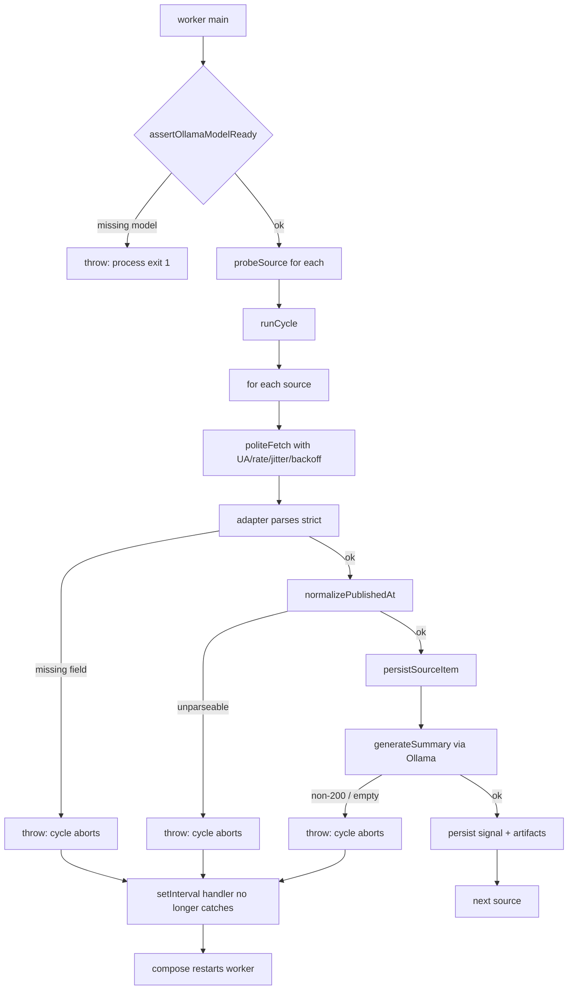

## Guiding principles (apply to every change below)

- No silent fallbacks. No `?? defaultValue` on data that represents ingestion output (title, summary, url, publishedAt, etc.). If a field is missing, the adapter throws with the source name and field name.
- No swallowed errors. Every `catch { ... }` that does not rethrow is removed or converted to a throw. `catch` blocks may log context and then `throw`.
- Required env vars are validated at startup. Missing values crash with a clear message; no silent `?? "replace_me"`.
- Per-source failures are not hidden. One failed source fails its `source_checks` row, its cycle bubbles up, and the worker logs the full error and exits non-zero. Compose will restart it; next cycle tries again.
- AI summaries are mandatory. If Ollama is not reachable or the model is missing, the worker crashes. There is no template fallback.

---

## A. Ollama model pull — NOT deferred, wired into compose lifecycle

### A1. New `ollama-init` service in [compose.yaml](compose.yaml)

Add a one-shot init container that runs `ollama pull $OLLAMA_MODEL` against the live `ollama` service and exits. The `worker` depends on it with `service_completed_successfully` so the worker will not start until the model is in place.

```yaml
ollama-init:
  image: ollama/ollama:latest
  depends_on:
    ollama:
      condition: service_started
  environment:
    OLLAMA_HOST: http://ollama:11434
    OLLAMA_MODEL: ${OLLAMA_MODEL}
  entrypoint: ["/bin/sh","-c"]
  command: ["ollama pull \"$OLLAMA_MODEL\" && ollama show \"$OLLAMA_MODEL\" >/dev/null"]
  restart: "no"

worker:
  # ...existing config...
  depends_on:
    postgres:
      condition: service_healthy
    minio:
      condition: service_healthy
    ollama-init:
      condition: service_completed_successfully
```

### A2. Worker-side hard precondition check (new file)

Create [apps/worker/src/ollama.ts](apps/worker/src/ollama.ts):

- `assertOllamaModelReady(baseUrl, model)` calls `GET {baseUrl}/api/tags`, parses JSON, verifies `model` appears in `models[].name`. If the response is not 200 or the model is absent, throw with: `Ollama model '${model}' not available at ${baseUrl}. Tags returned: ${JSON.stringify(tags)}`.
- Called once at the top of `main()` in [apps/worker/src/index.ts](apps/worker/src/index.ts) **before** `runCycle()`. If it throws, the process exits.

### A3. Remove the Ollama fallback entirely

Replace the contents of [packages/ai/src/index.ts](packages/ai/src/index.ts). New `generateSummary` (renamed from `tryOllamaSummary` to signal intent):

- No `try/catch`. If `fetch` rejects, the rejection propagates.
- If `response.ok` is false: `throw new Error(\`Ollama ${response.status} ${response.statusText} for model ${config.ollamaModel}: ${await response.text()}\`)`.
- If `data.response` is empty or whitespace: `throw new Error(\`Ollama returned empty response for title: ${input.title}\`)`.
- Return `data.response.trim()`. No `fallbackSummary` function — delete it.

Update the single caller in [apps/worker/src/index.ts](apps/worker/src/index.ts) line 47:

```47:47:apps/worker/src/index.ts
    })) ?? draft.summary;
```

becomes a direct assignment: `const aiSummary = await generateSummary({...})`. If it throws, `processSource` fails loudly — which is the new contract.

---

## B. Timestamp handling — parse or throw, no nulls passed to Postgres

### B1. Two new helpers in [apps/worker/src/adapters.ts](apps/worker/src/adapters.ts)

- `parsePubMedDate(raw: string): string` — handles the known PubMed formats: `"2026 Dec"`, `"2026 Dec 15"`, `"2026"`, `"2026/12/15"`, `"2026 Dec 15 12:34"`. Maps the month word, constructs an ISO string, validates with `Number.isFinite(new Date(iso).getTime())`. Throws `Error(\`Unparseable PubMed pubdate: ${raw}\`)` on failure.
- `normalizePublishedAt(raw: string | null, sourceName: string): string` — if `raw` is null/empty, throws `Error(\`Missing publishedAt for source ${sourceName}\`)`. Tries `new Date(raw)` first, then `parsePubMedDate(raw)` as a second interpretation. Returns ISO-8601. No null return path.

### B2. Tighten `fetchPubMedItems`

Line 240 currently:
```240:244:apps/worker/src/adapters.ts
    const pubdate = String(record.pubdate ?? record.sortpubdate ?? "");
    const sourceName = String(record.fulljournalname ?? record.source ?? "PubMed");
    const summary = takeWords([sourceName, authors, title].filter(Boolean).join(" — "), 40);
    const url = `https://pubmed.ncbi.nlm.nih.gov/${id}/`;
    return { externalItemId: buildStableId([id, title, pubdate]), title, summary, url, publishedAt: pubdate || null, rawContent: JSON.stringify(record), metadata: { pmid: id, journal: sourceName, authors } } satisfies IngestedItem;
```

Becomes: read `record.sortpubdate` (ISO-like) preferentially, then `record.pubdate`. If both missing, throw with the PMID. `publishedAt` is the result of `parsePubMedDate`. Store `rawPubDate` and `sortPubDate` in `metadata` for forensics.

### B3. Hard-assert in `persistSourceItem`

In [apps/worker/src/index.ts](apps/worker/src/index.ts), before the INSERT, call `const publishedAt = normalizePublishedAt(item.publishedAt, source.source_name)` (requires passing `source` in; change the signature). Bind `publishedAt` to `$7`. This is the final gate — any adapter that slipped a bad date through crashes here with a clear source-scoped error.

### B4. Remove all other date fallbacks in adapters.ts

Every `publishedAt: new Date().toISOString()` on line 191, 205, 252, 267, 279, 288, 302 is a lie — it silently stamps "now" when the source had no date. Replace with explicit extraction from the HTML/JSON, and `throw` if the adapter genuinely cannot produce a date. For HTML-only sources (`competitor_site`, `payer`), the answer is that the HTML snapshot's `publishedAt` is genuinely unknown, so store `null` is not acceptable — instead, change the schema to require `published_at` and throw if missing, OR (proposal I recommend) change `source_items.published_at` to nullable and make the adapter explicitly return `null` for genuinely dateless snapshots (not `new Date()`). See question below.

---

## C. Polite HTTP layer (baseline politeness, as you chose)

### C1. New file [apps/worker/src/politeFetch.ts](apps/worker/src/politeFetch.ts)

Exports `politeFetch(url, init?) => Promise<Response>`. Internal state (module-level `Map<hostname, HostState>`):

- `HostState = { lastFetchAt: number; lock: Promise<void> }` — per-host serialization with 5s minimum gap + random 0–2000ms jitter. Next request waits on the lock.
- Built-in headers (callers cannot omit):
  - `User-Agent: LandScrapeBot/0.2 (+${LANDSCRAPE_CONTACT_URL}; mailto:${LANDSCRAPE_CONTACT_EMAIL})`
  - `From: ${LANDSCRAPE_CONTACT_EMAIL}`
  - `Accept: application/json, application/xml, text/xml, text/html;q=0.9, */*;q=0.8`
- Conditional GET: caller passes `{ etag, lastModified }` cache keys; helper adds `If-None-Match` / `If-Modified-Since` if present and returns the raw `Response` so caller can branch on 304.
- Backoff: on 429 or 5xx, read `Retry-After` header (seconds or HTTP date), sleep, retry up to 3 times. After 3, throw `Error(\`politeFetch gave up on ${url} after 3 retries; last status ${status}\`)`.
- On `fetch` network rejection, propagate — no swallow.

### C2. Replace every `fetch(...)` and `fetchText(...)` call in the worker with `politeFetch`

All call sites in [apps/worker/src/adapters.ts](apps/worker/src/adapters.ts): lines 109, 229, 234, 250, 257, 271, 283, 299. `fetchText` is rewritten to wrap `politeFetch` and throw on non-OK non-304 responses.

### C3. Conditional-GET cache

Persist `last_etag` and `last_modified` in `sources.source_config` JSONB (no schema migration). After a successful fetch, update via a `query()` call. On 304, skip the source — log `[cycle] source=... status=not_modified` and mark `source_checks.status='completed'` with `result_count=0`.

### C4. Env vars (required, fail-fast)

Add to [packages/config/src/index.ts](packages/config/src/index.ts):
- `contactEmail: requireEnv("LANDSCRAPE_CONTACT_EMAIL")`  (default for this project: `matt@boro-tech.com`)
- `contactUrl:   requireEnv("LANDSCRAPE_CONTACT_URL")`    (default for this project: `https://boro-tech.com`)

`requireEnv` throws `Missing required env ${name}` at module load if absent. See section F.

---

## D. Remove fallbacks and defensive code across the codebase

### D1. [packages/config/src/index.ts](packages/config/src/index.ts) — strict env loading

Replace every `process.env.X ?? "default"` with `requireEnv("X")` for: `DATABASE_URL`, `OLLAMA_BASE_URL`, `OLLAMA_MODEL`, `LANDSCRAPE_TENANT_SLUG`, `LANDSCRAPE_INTERNAL_API_KEY`, `STORAGE_ENDPOINT`, `STORAGE_REGION`, `STORAGE_ACCESS_KEY`, `STORAGE_SECRET_KEY`, `STORAGE_BUCKET`, `STORAGE_PUBLIC_BASE_URL`, `REDIS_URL`, `API_PORT`, `WEB_PORT`, `ADMIN_PORT`, `LANDSCRAPE_CONTACT_EMAIL`, `LANDSCRAPE_CONTACT_URL`. Ensure [.env.example](.env.example) and [.env](.env) list every one. `nodeEnv` and `seedEnabled` may keep defaults since they're dev-only knobs (confirm with question below).

### D2. [packages/ai/src/index.ts](packages/ai/src/index.ts) — see A3. Delete `fallbackSummary`, delete `try/catch`.

### D3. [apps/worker/src/index.ts](apps/worker/src/index.ts) — remove error swallowing

Current offenders:

```82:82:apps/worker/src/index.ts
    try { await processSource(tenantId, source); } catch (error) { console.error(`Source processing failed for ${source.source_name}`, error); }
```

```88:88:apps/worker/src/index.ts
  setInterval(async () => { try { await runCycle(); } catch (error) { console.error("Worker cycle failed", error); } }, 1000 * 60 * 15);
```

New behavior:
- Inside `runCycle`, each source still gets its own `source_checks` row written with `status='failed'` (already done at line 72). But the outer loop no longer swallows. A thrown source aborts the cycle and propagates.
- `setInterval`'s inner handler no longer catches. An unhandled rejection crashes the worker; compose restarts it. This is the "hard loud failure" the user wants.
- `main().catch(...)` at line 90 stays — it's the last-resort top-level handler that prints and `process.exit(1)`s.

### D4. [apps/worker/src/adapters.ts](apps/worker/src/adapters.ts) — remove silent `??` fallbacks on ingestion data

For each of these, replace the `??` with a thrown error when the left side is missing:

- Line 215: `getFirstTagValue(block, ["title"]) ?? \`Untitled item ${index + 1}\`` → throw `RSS item missing <title> in source ${source.source_name}`.
- Line 238: `String(record.title ?? \`PubMed Article ${id}\`)` → throw `PubMed record ${id} missing title`.
- Line 252, 279, 302: `parsed.title ?? source.source_name` → throw if HTML has no `<title>`.
- Line 263: `String(item.title ?? item.session ?? \`Congress Item ${index + 1}\`)` → throw.
- Line 275: `String(item.title ?? item.product_description ?? \`Regulatory Item ${index + 1}\`)` → throw.

`?? []` on line 231 (`idlist ?? []`) stays — empty search result is legitimate. Similarly `cfg.query ?? "oncology biomarker therapy"` (line 226) stays because `source_config` defaults are intentional per-source config, not data fallbacks.

`normalizeUrl`'s `try { ... } catch { return maybeUrl; }` on line 80 becomes: throw `Invalid URL ${maybeUrl} in ${baseUrl} context` — bad URLs should not be silently round-tripped.

### D5. [apps/worker/src/storage.ts](apps/worker/src/storage.ts) line 24 — `catch {}` hides every S3 error

Replace with: `catch (err) { if (!isBucketNotFound(err)) throw err; await artifactStorage.send(new CreateBucketCommand(...)); }`. Only "bucket not found" triggers create; everything else (auth failures, network) throws.

### D6. Worker API clients — the `process.env.API_INTERNAL_URL ?? "http://api:4000"` pattern in [apps/web/app/lib/api.ts](apps/web/app/lib/api.ts) and [apps/admin/app/page.tsx](apps/admin/app/page.tsx) is NOT ingestion data and these defaults match the compose network — these stay, per "don't add frivolous" guidance. Flag for confirmation (see question below).

---

## E. Source URL corrections (the seed rows that are broken)

All changes live in [infra/db/001_landscrape_schema.sql](infra/db/001_landscrape_schema.sql). Reseeding requires `docker compose down -v` + `rm -rf postgres_data` — documented in README.

| Row (current `external_id`) | Current `base_url` | Problem | Replacement |
|---|---|---|---|
| `comp-rivala-site` | `https://example.com/rival-a` | Placeholder — 100% broken | `https://www.pfizer.com/newsroom/press-releases` (HTML scrape with Playwright; filter to oncology) |
| `asco-agenda-feed` | `https://meetings.asco.org/abstracts-presentations/rss` | Returns 404 HTML (200 status, but not RSS) | `https://clinicaltrials.gov/api/v2/studies?query.cond=oncology&format=json&pageSize=20` (JSON API, extend congress adapter to parse `studies[].protocolSection`) — rename row to `ClinicalTrials.gov Oncology Studies` |
| `fda-oncology-feed` | `https://www.fda.gov/about-fda/contact-fda/stay-informed/rss-feeds/biologics/rss.xml` | FDA blocks the old UA; worker probe will confirm the new UA works | `https://www.fda.gov/about-fda/contact-fda/stay-informed/rss-feeds/press-announcements/rss.xml` |
| `cms-payer-feed` | `https://www.cms.gov/newsroom/rss-feeds` | Verified working — keep as-is, just confirmed in probe logs | (unchanged) |
| `pubmed-oncology-feed` | (eutils) | Verified working | (unchanged) |

### Congress adapter extension for ClinicalTrials.gov

In [apps/worker/src/adapters.ts](apps/worker/src/adapters.ts), extend `fetchCongressItems` to detect the CT.gov response shape (`json.studies` array) and map:
- `externalItemId` = `NCTId`
- `title` = `protocolSection.identificationModule.officialTitle` (throw if missing)
- `publishedAt` = `protocolSection.statusModule.lastUpdatePostDateStruct.date` (throw if missing)
- `url` = `https://clinicaltrials.gov/study/${NCTId}`
- `rawContent` = JSON.stringify(protocolSection)

---

## F. Startup probe + per-source cycle logs

### F1. New file [apps/worker/src/probe.ts](apps/worker/src/probe.ts)

`probeSource(source): Promise<ProbeResult>` does a `politeFetch` HEAD (falling back to GET with early abort) on `source.base_url` with a 10s `AbortController` timeout. Returns `{ ok, status, contentType, durationMs }`. Does not throw — probe failures are reported, not fatal, because the probe is diagnostic.

### F2. Wire into `main()` in [apps/worker/src/index.ts](apps/worker/src/index.ts)

After `assertOllamaModelReady` and before first `runCycle`:

```
console.log("[probe] starting source probes");
for (const s of await loadActiveSources(tenantId)) {
  const r = await probeSource(s);
  console.log(`[probe] source=${s.source_name} url=${s.base_url} ok=${r.ok} status=${r.status} ct=${r.contentType} ms=${r.durationMs}`);
}
```

### F3. Per-source cycle log in `runCycle`

After each `processSource` succeeds, log: `[cycle] source=${s.source_name} status=ok items=${n} newSignals=${m} ms=${t}`. On failure (before rethrowing in D3): `[cycle] source=${s.source_name} status=FAILED error=${e.message}`.

---

## G. Latent regex bug in congress HTML fallback

Line 266 in the current file:

```266:266:apps/worker/src/adapters.ts
  const blocks = [...raw.matchAll(/<(article|section|li)[^>]*>([\s\S]*?)<\/>/gi)].map((m) => stripTags(m[2])).filter((text) => text.length > 80).slice(0, 12);
```

The closing pattern `<\/>` never matches real HTML. Fix to `<\/\1>` (backreference to the capture group) so `<article>...</article>` / `<section>...</section>` / `<li>...</li>` each close correctly.

---

## H. Documentation & env scaffolding

- Update [.env.example](.env.example) to list every required env introduced above, with no defaults, each commented with what it's for. Include:
  - `LANDSCRAPE_CONTACT_EMAIL=matt@boro-tech.com`
  - `LANDSCRAPE_CONTACT_URL=https://boro-tech.com`
  - `OLLAMA_MODEL=llama3.1:8b`
- Update [.env](.env) with the same values (project-local).
- Update [README.md](README.md) with a "Reseed from scratch" section documenting: `docker compose down -v && rm -rf postgres_data && docker compose up --build`, and a "First boot" section explaining that `ollama-init` will download ~4.7GB for `llama3.1:8b` and the worker will not start until that completes.

---

## I. Verification sequence (the final gate)

After implementation, run this sequence and confirm every log line:

1. `docker compose down -v && rm -rf postgres_data`
2. `docker compose up --build`
3. Expect `ollama-init` to complete with `pulling manifest … success` and exit 0.
4. Expect worker to log `[probe]` lines for all 5 sources with `ok=true` for PubMed, CT.gov, FDA, CMS, and Pfizer.
5. Expect `[cycle] source=… status=ok items=N newSignals=M` lines for every source.
6. Expect zero Postgres `invalid input syntax for type timestamp` errors.
7. Expect Ollama `POST /api/generate` returning 200 for every new signal (no 404, no fallback path).
8. Induce failures to confirm loudness: temporarily set `OLLAMA_MODEL=nonexistent:0.1b` → worker should crash at `assertOllamaModelReady` before starting a cycle. Temporarily break a `base_url` → that source's cycle logs `FAILED`, the whole cycle exits with the error, and the container restarts.

---

## Data flow after changes



---

## Open clarifications (2 items I need before executing)

1. For HTML-only sources with no publication date in the page (competitor press-release index pages, payer policy pages), do you want:
   - (a) `source_items.published_at` stays `TIMESTAMPTZ NOT NULL` and the adapter must extract a real date from the HTML (throw if none found), OR
   - (b) column becomes nullable and the adapter returns explicit `null` when the HTML genuinely has no date (but never `new Date()` as a lie)?
2. For `nodeEnv` (development/production) and `seedEnabled` in config, do those keep safe defaults, or do you want every env var including those to be required? (Strict position says required; practical position keeps these two.)