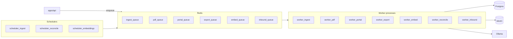

# Multi-worker LandScrape implementation plan

## Current baseline (constraints)

- Ingestion today: single loop in [`apps/worker/src/index.ts`](apps/worker/src/index.ts) (`setInterval` ~15m), calling [`fetchSourceItems`](apps/worker/src/adapters.ts) (HTTP + Playwright).
- Redis: [`REDIS_URL`](packages/config/src/index.ts) exists; **no application usage** in `apps/` yet.
- DB: [`signals.search_embedding VECTOR(1536)`](infra/db/001_landscrape_schema.sql) exists but is **never populated**; [`packages/ai`](packages/ai/src/index.ts) only implements **Ollama `generate`** (summaries), not embeddings.
- Artifacts: [`source_assets`](infra/db/001_landscrape_schema.sql) `asset_type` CHECK is **`screenshot` | `dom_snapshot` only**—PDFs need a migration.
- API reports: synchronous path in [`apps/api/src/services/reportService.ts`](apps/api/src/services/reportService.ts) (`buildExecutiveBrief`)—no async export to MinIO yet.

## Target architecture

**Recommendation:** Add a small shared package (e.g. [`packages/jobs`](packages/jobs)) wrapping **BullMQ** + typed job payloads, shared by API and all workers. Run **multiple Node processes** (Compose services) with the **same Docker image** and different `WORKER_ROLE` / command—avoid duplicating Dockerfiles unless binary size forces a slim “no Chromium” image for non-browser workers.

---

## Phase 0 — Schema and cross-cutting foundations

**Postgres (new migration file after [`001_landscrape_schema.sql`](infra/db/001_landscrape_schema.sql), e.g. `002_worker_platform.sql`):**

- **`job_runs`** (or reuse BullMQ’s Redis state only): optional table for **tenant-visible** history—`job_id`, `tenant_id`, `job_type`, `status`, `payload` (JSONB redacted), `error`, `created_at`, `finished_at`. Lets admin UI and reconciliation reference the same IDs as queue jobs.
- **`report_exports`**: `report_id`, `status`, `format` (`pdf` | `pptx` | `markdown_bundle`), `storage_key`, `error_message`, timestamps—so the API can poll/download without blocking.
- **Extend `source_assets.asset_type`** to include **`pdf`** (and optionally `extracted_text`)—relax or extend the CHECK constraint.
- **`webhook_endpoints`**: `tenant_id`, `path_secret_hash`, `is_active`, `allowed_sources` JSONB—verify HMAC or signed path for inbound HTTP.
- **`inbound_events`**: raw payload, `tenant_id`, `dedupe_key`, `processing_status`—for email + webhook idempotency.
- **Portal credentials**: prefer extending existing [`connectors`](infra/db/001_landscrape_schema.sql) (`connection_config` JSONB) with **non-plaintext** handling plan (see security)—or add `portal_sessions` with encrypted blob + `expires_at`.

**Config:** New env vars (document in [`.env.example`](.env.example)): queue prefixes, concurrency per worker, embedding model name, webhook signing secrets, optional IMAP for email.

**Security baseline:** Never log full credentials; define a single **encryption helper** (e.g. AES-256-GCM with `LANDSCRAPE_CREDENTIALS_KEY`) for `connection_config` secrets at rest; rotate strategy documented.

---

## Phase 1 — Queue-backed ingestion worker (replaces “fat loop”)

**Goal:** Decouple scheduling from execution; add retries, per-source concurrency, and backoff without blocking the whole tenant.

1. Add **`packages/jobs`**: BullMQ `Queue` + `Worker` factories, shared TypeScript types for job names (`ingest:source`, `pdf:extract`, etc.).
2. **`scheduler` process** (new entry, e.g. `apps/worker/src/scheduler.ts`): On interval, query active `sources` (respect `poll_frequency_minutes`), enqueue **`ingest:source`** jobs with `{ tenantId, sourceId }`—idempotency via **jobId** `ingest:${sourceId}:${bucketStart}` or BullMQ `jobId` option.
3. **Refactor** current [`processSource`](apps/worker/src/index.ts) path into **`ingest:source` worker** handler (reuse `fetchSourceItems`, `persistSignalFromItem`, etc.). Keep Playwright in this worker **or** split to `ingest:browser` queue with **global concurrency 1–2** if memory is tight.
4. **Deprecate** the old monolithic `setInterval(runCycle)` in favor of scheduler + workers; retain a **feature flag** for one release if needed.
5. **Compose:** New service `worker-ingest` (or `WORKER_ROLE=ingest`); optional separate `worker-scheduler` with minimal resources.

**Files to touch:** [`apps/worker/package.json`](apps/worker/package.json) (bullmq dependency), new `scheduler.ts`, refactor [`index.ts`](apps/worker/src/index.ts), [`compose.yaml`](compose.yaml), [`infra/docker/worker.Dockerfile`](infra/docker/worker.Dockerfile) CMD pattern.

---

## Phase 2 — PDF / document worker

**Goal:** Extract text (and optional tables) from PDFs linked from feeds or uploaded as assets; align with README gap “PDF abstract extraction.”

1. **Job:** `pdf:extract` with `{ tenantId, sourceItemId | url, storageKey? }`.
2. **Implementation:** Node libraries such as **`pdf-parse`** (text) or **`pdfjs-dist`** (more control); optional **OCR** later (not v1 unless required)—keep in a **separate worker** to isolate native/CPU spikes.
3. **Output:** Insert `source_assets` row with `asset_type = 'pdf'` or store **`extracted_text`** in `source_items.raw_content` append/metadata; optionally spawn a **follow-up** `ingest:signal` step if the item should become a signal.
4. **Trigger:** From `ingest:source` adapter when MIME is `application/pdf` or `source_config.extractPdf === true`.

**Schema:** Phase 0 migration for `pdf` in `source_assets`.

---

## Phase 3 — Authenticated portal worker

**Goal:** Handle gated sites (payer portals, congress backends) using **session-aware** automation—not just headless fetch.

1. **Job:** `portal:ingest` with `{ tenantId, sourceId, connectorId? }`.
2. **Playwright:** Use **persistent browser context** per connector (`userDataDir` in a **volume** or ephemeral with re-login), loaded from decrypted [`connectors.connection_config`](infra/db/001_landscrape_schema.sql) (login URL, selectors, MFA placeholder hooks).
3. **Isolation:** **Dedicated queue** with **low concurrency**; separate from public RSS ingestion; stricter timeouts.
4. **Adapter contract:** Extend [`source_config`](apps/worker/src/adapters.ts) with `authMode: 'portal'`, `connectorRef`, post-login `waitForSelector`—keep portal-specific logic in a small module to avoid bloating `adapters.ts`.

**Note:** Full MFA/SSO may require human-in-the-loop or external vault—plan v1 as **stored username/password or cookie bundle** with clear security docs.

---

## Phase 4 — Embedding / search-index worker

**Goal:** Populate [`signals.search_embedding`](infra/db/001_landscrape_schema.sql) for semantic search.

1. **Dimension lock:** Column is **1536**—use an embedding model with **1536 dimensions** (e.g. OpenAI-compatible `text-embedding-3-small`) **or** add a migration to change dimension / use a separate embedding table if staying on Ollama-only (Ollama embedding models often differ in size—**do not** write vectors until dimensions match).
2. **Add** `embedText` (or batch) in [`packages/ai`](packages/ai/src/index.ts) calling Ollama **`/api/embeddings`** or OpenAI-compatible API behind config.
3. **Job:** `embed:signal` with `{ signalId }` or batch cron `embed:backfill` with `WHERE search_embedding IS NULL LIMIT N`.
4. **Worker:** `worker-embed` with rate limits to avoid starving Ollama used by summaries.

---

## Phase 5 — Export / report generation worker

**Goal:** Async PDF/PPTX (and “markdown bundle”) to MinIO; API returns **202 + job id** or polls `report_exports`.

1. **API change:** New endpoint e.g. `POST /v1/tenants/:slug/reports/:id/export` → enqueue `export:report` → row in `report_exports`.
2. **Worker:** Load report + signals; render PDF (e.g. **md → PDF** via puppeteer/chrome **or** a pure-JS PDF lib for simpler layout); upload to MinIO; update `report_exports`.
3. **UI contract:** Expose download URL from `STORAGE_PUBLIC_BASE_URL` or signed URLs later.

**Dependency:** May share Chromium stack with Playwright—consider **same worker image** as ingest or a **dedicated export** service with headless Chrome.

---

## Phase 6 — Reconciliation / ops worker

**Goal:** Proactive health: stale sources, failed checks, queue depth alerts.

1. **Scheduled job** (BullMQ repeatable or lightweight cron process): Query `sources` where `last_checked_at` older than `poll_frequency_minutes + slack`, `source_checks` with repeated `failed`, count `job_runs` failures.
2. **Actions:** Insert [`alerts`](infra/db/001_landscrape_schema.sql) or internal-only `audit_logs`; optional webhook to Slack later.
3. **Process:** `worker-reconcile` single-threaded, no heavy deps.

---

## Phase 7 — Inbound email + webhooks (optional but in scope)

**Webhooks (lower risk, implement first):**

- **HTTP:** `POST /v1/inbound/webhook/:tenantSlug/:secret` (or HMAC header) on **API**, validate signature, enqueue `inbound:normalize` on **`inbound_queue`**.
- **Worker `worker-inbound`:** Parse payload → create **`source_items`** / **`signals`** per tenant rules (`source_config` routing); use **`inbound_events.dedupe_key`** (message-id hash).

**Email:**

- **v1:** **IMAP polling** worker (`imapflow` or similar): periodic fetch, enqueue same `inbound:normalize` jobs. Store last UID in `connectors.connection_config` or new `email_mailbox_state` table.
- **v2 (production):** Inbound parse via **Mailgun/SendGrid** → same webhook handler (no IMAP).

---

## Docker Compose and rollout

- Extend [`compose.yaml`](compose.yaml): `worker-scheduler`, `worker-ingest`, `worker-pdf`, `worker-portal`, `worker-embed`, `worker-export`, `worker-reconcile`, `worker-inbound`; all `depends_on` **redis** + **postgres**; browser-heavy services retain **`shm_size`** like current [`worker`](compose.yaml) service.
- **Scale:** Set BullMQ **concurrency** per queue in env; cap `portal` and `ingest` Playwright separately.

---

## Testing and observability

- **Unit tests:** Job payload validation, PDF text extraction golden files, webhook signature verification.
- **Integration:** Docker Compose profile that runs one job of each type against demo tenant.
- **Logging:** Structured logs with `jobId`, `tenantId`, `sourceId`; never log secrets or raw webhook bodies in prod (hash ids only).

---

## Suggested implementation order (dependencies)

| Order | Deliverable | Depends on |
|-------|-------------|------------|
| 1 | Phase 0 migrations + `packages/jobs` + env | — |
| 2 | Phase 1 queue ingestion | 1 |
| 3 | Phase 6 reconciliation | 1–2 (uses DB + optional job_runs) |
| 4 | Phase 4 embeddings | 1 + model/dimension decision |
| 5 | Phase 2 PDF worker | 1–2 |
| 6 | Phase 5 export worker | 1 + MinIO patterns from worker |
| 7 | Phase 3 portal worker | 1–2 + credentials encryption |
| 8 | Phase 7 webhooks + email | 1 + API routes |

This order ships **core reliability early** (queue + reconciliation), then **search** and **content depth** (PDF), then **delivery** (exports), then **high-friction** portal auth, then **ingress** diversity.
