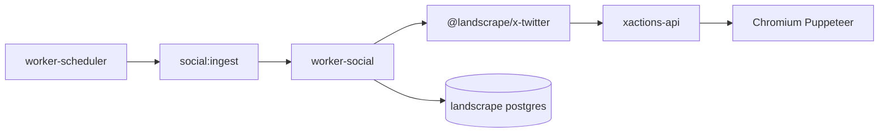

# X / Twitter ingest via self-hosted XActions (A1a)

LandScrape monitors public X posts using a **self-hosted XActions stack** (Puppeteer browser scraping) plus the existing `social:ingest` worker pipeline.

See also: [x-social-ingest.md](x-social-ingest.md) (connector/source setup).

## Architecture



Compose services:

| Service | Role |
|---------|------|
| `xactions-postgres` | XActions Prisma DB |
| `xactions-redis` | XActions Bull job queue |
| `xactions-api` | REST API + inline browser scrapes (`POST /api/ai/scrape/*`) |
| `xactions-worker` | Background Puppeteer jobs |
| `worker-social` | Consumes `social:ingest`, calls XActions API |

Host port **3002** maps to XActions API (avoids `admin:3001`).

## Environment

In `.env` (see `.env.example`):

```bash
LANDSCRAPE_X_BACKEND=api
XACTIONS_API_URL=http://xactions-api:3001
XACTIONS_API_TIMEOUT_MS=120000
XACTIONS_POSTGRES_PASSWORD=...
XACTIONS_JWT_SECRET=...
XACTIONS_SESSION_SECRET=...
```

On `xactions-api` / `xactions-worker`, `X402_DISABLED=true` disables micropayment middleware for internal `/api/ai/*` calls.

For local dev without the XActions stack, set `LANDSCRAPE_X_BACKEND=http` (in-process GraphQL; requires `authToken` and `ct0`).

## Connector secrets

1. Log in at [x.com](https://x.com).
2. DevTools → Application → Cookies → `https://x.com`.
3. Copy **`auth_token`** into connector `secrets.authToken` (or `auth_token`).
4. For `LANDSCRAPE_X_BACKEND=http` only, also copy **`ct0`**.

```json
{
  "connector_name": "X session",
  "connector_type": "social",
  "secrets": {
    "authToken": "<from browser>",
    "ct0": "<only if using http backend>"
  }
}
```

Requires `LANDSCRAPE_CREDENTIALS_KEY` in production.

## Source example

```json
{
  "source_name": "X oncology search",
  "source_type": "social",
  "poll_frequency_minutes": 60,
  "source_config": {
    "provider": "x",
    "connectorId": "<connector-uuid>",
    "mode": "search",
    "query": "bezuclastinib OR avapritinib lang:en",
    "limit": 50,
    "filter": "latest",
    "scraper": "api"
  }
}
```

Modes: `search` (`query`), `account` (`username`, optional `includeReplies`), `hashtag` (`hashtag`).

## Agent tools

When `LANDSCRAPE_X_BACKEND=api` and a social connector exists:

| Tool ID | Purpose |
|---------|---------|
| `native.x.search` | Ad-hoc X search for the agent |
| `native.x.profile` | Profile metadata for a username |

Optional compose profile `agent-x` runs `mcp-xactions` (`xactions-mcp` in remote mode) for external MCP clients.

## Troubleshooting

| Symptom | Action |
|---------|--------|
| `social:ingest` jobs never run | Ensure `worker-social` is up (not only `worker-scheduler`) |
| 402 from XActions | Confirm `X402_DISABLED=true` on xactions services (patched image) |
| Chromium OOM | Increase `shm_size` on `xactions-api` (default 1gb) |
| Auth failures | Refresh `auth_token`; check `source_checks.error_message` |
| Slow jobs | Lower `limit`, keep `LANDSCRAPE_SOCIAL_CONCURRENCY=1` |

## Related

- [MCP Clinical Reference Kit](mcp-clinical-reference-kit.md) — separate MCP sidecars (FDA, PubMed, trials)
- Upstream: [XActions](https://github.com/nirholas/xactions) v3.1.0
